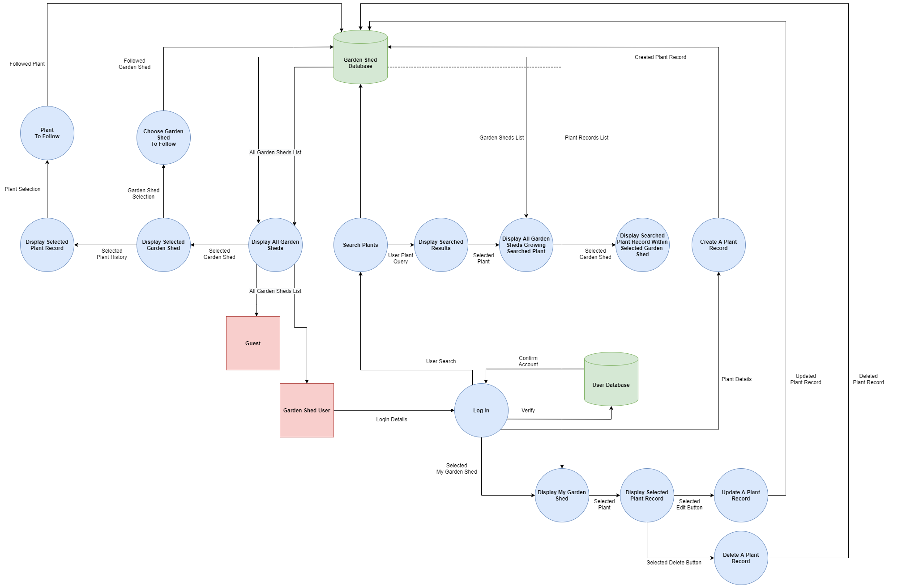
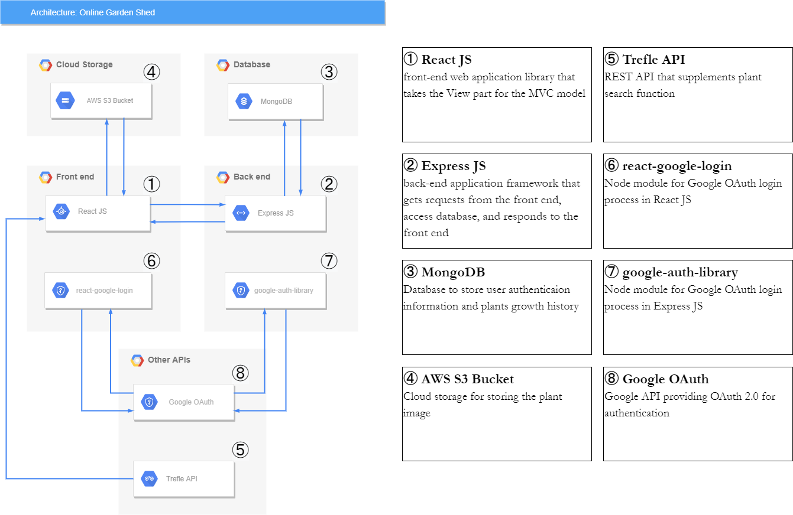

<h1 align="center"> Online Garden Shed
</h1>

# Table of Contents

* [R1. Description](#R1.-Description)
  * [Purpose](#Purpose)
  * [Functionality / features](#Functionality-/-features)
  * [Target audience](#Target-audience)
  * [Tech stack](#Tech-stack)
* [R2. Dataflow Diagram](#R2.-Dataflow-Diagram)
* [R3. Application Architecture Diagram](#R3.-Application-Architecture-Diagram)
* [R4. User Stories](#R4.-User-Stories)
* [R5. Wireframes for multiple standard screen sizes](#R5.-Wireframes-for-multiple-standard-screen-sizes)
* [R6. Screenshots of Trello](#R6.-Screenshots-of-Trello)
   

# R1. Description
## Purpose
Online Garden Shed is for improving your gardening skills by keeping track of plants growth history and learning from other gardeners' experiences. It also provides a way for gardeners to be a part of a much bigger community by bringing their records and experiences online. By having access to the online garden sheds and setting up notifications, gardeners can be more actively involved in their gardening community not restricted by their location.

## Functionality / features
**Storing plants history**: By allowing users to keep a history of their plants, it will help them and others to have greater success when it comes to growing the same plant. Things like soil ph, watering frequency, climate, fertilising, pests, image uploads, etc will all be useful information that a user can see in a plants history. 
**Image uploading**: Through the process of creating and updating a plant record, you're able to upload images at the beginning and as you continue to grow the plant, you can update it with new images showing a plants progress. 
**REST API for plants**: When creating a new plant record, the user will need to specify the correct name. For this prupose the API will help to easily define the plants name and some general information about the plant. This will ensure some consistency for users browsing the same plant grown from different garden sheds. 
**Browsing other garden sheds**: Not only can a user look over their plant records, but they can view other garden shed records provided they've been made public.
**Following other garden sheds**: A user can follow other garden sheds and have a quick access menu to those sheds and also setup email notification of any updates to anything witin a specific shed they follow. 
**Following plants**: A user can follow a specific plant instead of garden shed. This means they will see the same plant grown by many different garden sheds. 
**Authentication and authorization**: Google OAuth will be implemented for easy authentication and authorisation. 
**Email notifications**: A user can receive email notifications on different updates, like any within a garden shed, or a specific plant that they follow.

## Target audience
* It is sutable for everyone, but particularly for those interested in gardening and especially anyone who is either a beginner and needs guidance and examples to follow or someone with more exprience who wants to keep their own records and share them with the gardening community.

## Tech stack
* Mongo DB: Database to store user authentication information and plants growth history
* Express JS: Back-end web application framework
* React JS: Front-end web application library
* Node JS: JavaScript runtime environment
* AWS S3 Bucket or Cloudinary: Cloud storage for holding the plant images
* react-google-login: Node module for Google OAuth login process in React JS
* google-auth-library: Node module for Google OAuth login process in Express JS
* jwt: Node module for the authentication communcation between React JS and Express JS
* nodemailer: Node module for sending email notifications

[Go back](#table-of-contents)   

# R2. Dataflow Diagram

[Go back](#table-of-contents)   

# R3. Application Architecture Diagram

[Go back](#table-of-contents)   

# R4. User Stories
* As a guest, I want to be able to see other users garden shed plant history without the need of sign up, so I can look around and without any obligations.
* As a user, I want to be able to sign up or log in, so I can create plant history with photos and written logs.
* As a user, I want to create plant history with photos and written logs, so I can maintain the history of plants growth.
* As a user, I want to be able to search for plants during the creation of a new plant log, so I can bring up detailed info about that specific plant.
* As a user, I want to be able to browse MY OWN garden shed plant history list, so I can update or delete a specific plant history.
* As a user, I want to be able to update or delete the history of plants growth, so I can learn and share previous gardening attemps with myself and for other users.
* As a user, I want to be able to get email notifications when it comes time to water or fertilise the plants, so I can stick to the schedule.
* As a user, I want to be able to search a specific plant, so I can look at the history and follow the progress of a specific plant grown by many garden sheds.
* As a user, I want to be able to follow a specific plant, so I can get email notifications when the plants that I follow are updated.
* As a user, I want to be able to follow other garden sheds, so I can get email notifications when the following garden sheds update any plant history.
* As a user, I want to be able to get email notifications when the garden shed that I am following updates any plant history, so I can keep updated with the progress of any plant records.

[Go back](#table-of-contents)   

# R5. Wireframes for multiple standard screen sizes

[Go back](#table-of-contents)   

# R6. Screenshots of Trello

[Go back](#table-of-contents)   
